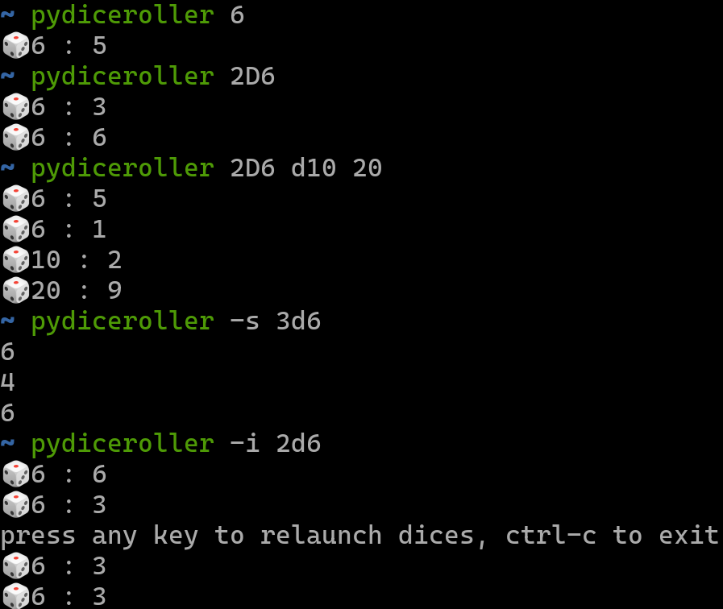

# :dice: pyconwaysgame

pydiceroller is a minimal diceroller


## Démo


## 🚀 How to use **pyconwaysgame**

pydiceroller 6 #one 6dice
pydiceroller 2D6 #two 6dice
pydiceroller D10 20 #one 10dice and one 20dice
pydiceroller S2D6 #sum of two 6dice
## 🚀🚀 Options

```
positional arguments:
  dices         dices, with format example : 6, D6, 2D10, S3D10 (for sum) -can give two or more parameters-

optional arguments:
  -h, --help    show this help message and exit
  -u, --update  self-update, alternatively, use pip(3) install --upgrade pydiceroller for manual update
  -s, --silent  minimal output

```  
## ⚙️ Install/Upgrade

### Prerequisites

- Install Python 3 for your system
- Install pip3* for your system
- Install git for your system


 ### Installation 

``pip3 install pyconwaysgame``

### Upgrade


``pyconwaysgame -u``
 
 or

 `` pip3 install --upgrade pydiceroller``

*_Install pip instead of pip3, if pip3 does not exist for your OS_

## :package: Changelog

See [this page](CHANGELOG.md)

## License

MIT License

See [this page](LICENSE) for details
    