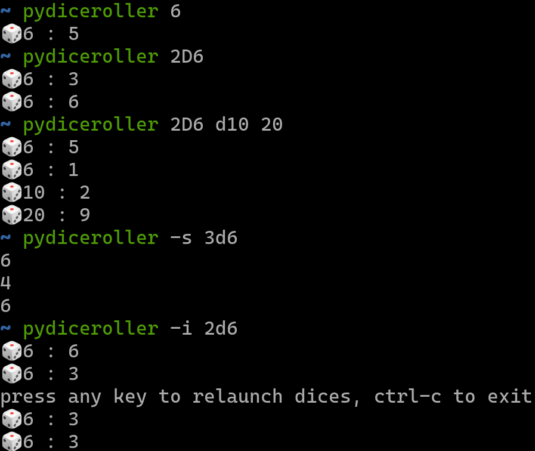

# 🎲 🎲 pydiceroller 🎲 🎲 

pydiceroller is a minimal diceroller in your terminal

## Démo


## 🚀 How to use **pydiceroller**
```
pydiceroller 6 #one 6dice
pydiceroller 2D6 #two 6dice
pydiceroller D10 20 #one 10dice and one 20dice
pydiceroller S2D6 #sum of two 6dice
```
## 🚀🚀 Options

```
positional arguments:
  dices         dices, with format example : 6, D6, 2D10, S3D10 (for sum) -can give one or more parameters-

optional arguments:
  -h, --help    show this help message and exit
  -s, --silent  minimal output, use for pipe commands
  -i, --infinite  press entry to relaunch same dices, ctrl-c to exit 

```  
## ⚙️ Install

See [this page](INSTALL.md)

## :construction_worker: Contribution

See [this page](CONTRIBUTING.md)

## :package: Changelog

See [this page](CHANGELOG.md)


## License

MIT License

Copyright (c) 2021 [thib1984](https://github.com/thib1984)

See [this page](LICENSE.txt) for details
    